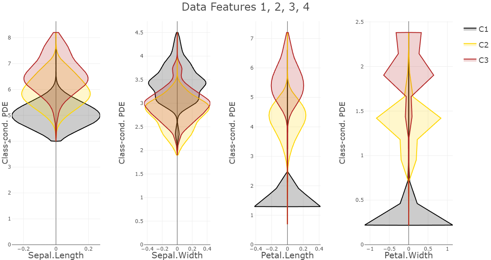
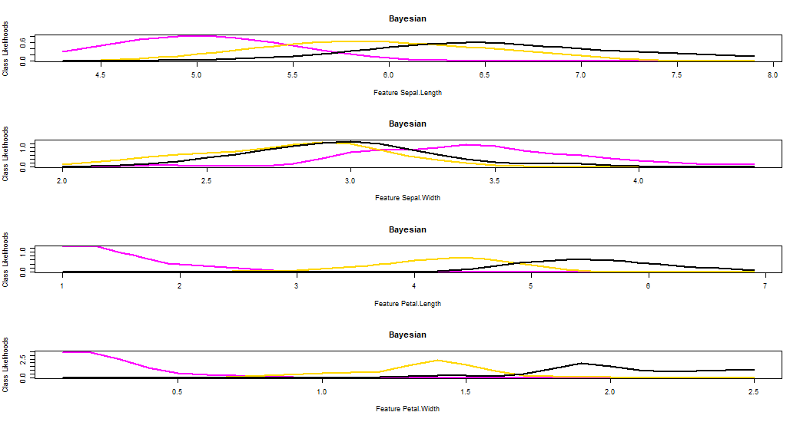
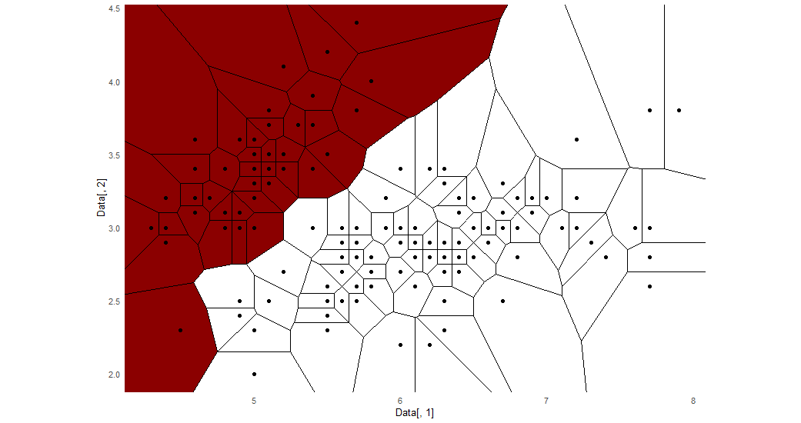

[](https://cran.r-project.org/package=PDEnaiveBayes)
[](https://r-pkg.org/pkg/PDEnaiveBayes)
[](https://r-pkg.org/pkg/PDEnaiveBayes)

# PDEnaiveBayes

### Table of Contents  
[1. Introduction](#introduction)  
[2. Installation](#installation)  
[3. Additional Resources](#additional)  
[4. References](#references)  

## 1. Introduction <a name="introduction"/>

A nonparametric, multicore-capable plausible naive Bayes classifier based on the Pareto density estimation (PDE) featuring a plausible approach to a pitfall in the Bayesian theorem covering low evidence cases [Stier et al., 2026].

The **PDEnaiveBayes** package provides a nonparametric approach to Naive Bayes classification, relying on Pareto Density Estimation (PDE) for likelihood modeling. It offers functionalities for:

- Training standard and multicore PDE-based Naive Bayes classifiers
- Estimating likelihoods and priors nonparametrically
- Applying Bayes’ theorem in a numerically stable manner
- Plotting likelihoods, posteriors, and decision boundaries

### Training and Prediction

#### Train_naiveBayes

Train a Pareto-density-based Naive Bayes classifier.

```r
data(Hepta)
Data <- Hepta$Data
Cls  <- Hepta$Cls
model <- Train_naiveBayes(Data, Cls, Gaussian = FALSE)
table(Cls, model$ClsTrain)
```

#### Train_naiveBayes_multicore

Multicore version of the PDE-based Naive Bayes training.

```r
if (requireNamespace("FCPS")) {
  data(Hepta)
  Data <- Hepta$Data
  Cls  <- Hepta$Cls
  model_mc <- Train_naiveBayes_multicore(
    cl       = NULL,
    Data     = Data,
    Cls      = Cls,
    Gaussian = FALSE,
    Predict  = TRUE
  )
  table(Cls, model_mc$ClsTrain)
}
```

#### Predict_naiveBayes

Predict class memberships for new data using a trained naive Bayes model.

```r
if (requireNamespace("FCPS")) {
  V    <- FCPS::ClusterChallenge("Hepta", 1000)
  Data <- V$Hepta
  Cls  <- V$Cls

  ind       <- 1:length(Cls)
  ind_train <- sample(ind, 800)
  ind_test  <- setdiff(ind, ind_train)

  model <- Train_naiveBayes(Data[ind_train, ], Cls[ind_train], Gaussian = FALSE)
  res   <- Predict_naiveBayes(Data[ind_test, ], Model = model)

  table(Cls[ind_test], res$ClsTest)
}
```

#### predict.PDEbayes

S3 prediction method for PDE-based naive Bayes models.

```r
if (requireNamespace("FCPS")) {
  V    <- FCPS::ClusterChallenge("Hepta", 1000)
  Data <- V$Hepta
  Cls  <- V$Cls

  ind       <- 1:length(Cls)
  ind_train <- sample(ind, 800)
  ind_test  <- setdiff(ind, ind_train)

  model   <- Train_naiveBayes(Data[ind_train, ], Cls[ind_train], Gaussian = FALSE)
  ClsTest <- predict.PDEbayes(object = model, newdata = Data[ind_test, ])
  table(Cls[ind_test], ClsTest)
}
```

### Probability and Density Utilities

#### getPriors

Compute class priors from class proportions.

```r
if (requireNamespace("FCPS")) {
  data(Hepta)
  Cls    <- Hepta$Cls
  Priors <- getPriors(Cls)
  print(Priors)
}
```

### Visualization Tools

The following functions visualize either the learned likelihoods, the resulting posterior probabilities, or a 2D Bayesian decision surface. They are primarily useful for inspection and model interpretability.

#### PlotNaiveBayes

Visualize the PDE-based naive Bayes model for all or selected features.

```r
Data <- as.matrix(iris[, 1:4])
Cls  <- as.numeric(iris[, 5])

model <- Train_naiveBayes(Data = Data, Cls = Cls, Plausible = FALSE)
FeatureNames <- colnames(Data)

PlotNaiveBayes(Model = model$Model, FeatureNames = FeatureNames)
```




#### PlotLikelihoods

Plot likelihoods for feature-class combinations.

```r
Data <- as.matrix(iris[, 1:4])
Cls  <- as.numeric(iris[, 5])

model <- Train_naiveBayes(Data = Data, Cls = Cls, Plausible = FALSE)

PlotLikelihoods(
  Likelihoods = model$Model$ListOfLikelihoods,
  Data        = Data
)
```

#### PlotLikelihoodFuns

Plot likelihood functions as obtained from PDE or Gaussian estimation.

```r
Data <- as.matrix(iris[, 1:4])
Cls  <- as.numeric(iris[, 5])

model <- Train_naiveBayes(Data = Data, Cls = Cls, Plausible = FALSE)

PlotLikelihoodFuns(
  LikelihoodFuns = model$Model$PDFs_funs,
  Data           = Data
)
```




#### PlotPosteriors

Plot posterior class probabilities for a selected class.

```r
Data <- as.matrix(iris[, 1:4])
Cls  <- as.numeric(iris[, 5])

model <- Train_naiveBayes(Data = Data, Cls = Cls, Plausible = FALSE)

PlotPosteriors(
  Data       = Data,
  Posteriors = model$Posteriors,
  Class      = 1
)
```

#### PlotBayesianDecision2D

Display a 2D Bayesian decision surface.

```r
Data <- as.matrix(iris[, 1:4])
Cls  <- as.numeric(iris[, 5])

model <- Train_naiveBayes(Data = Data, Cls = Cls, Plausible = FALSE)

PlotBayesianDecision2D(
  X          = Data[, 1],
  Y          = Data[, 2],
  Posteriors = model$Posteriors,
  Class      = 1
)
```



### Tutorial Examples

The tutorial with several examples can be found on in the vignette on CRAN:

[Vignette](https://CRAN.R-project.org/package=PDEnaiveBayes/vignettes/PDEnaiveBayes.html)


## 2. Installation <a name="installation"/>

#### Installation using CRAN (once published)
```r
install.packages("PDEnaiveBayes", dependencies = TRUE)
```

#### Installation using GitHub
Please note, that dependencies have to be installed manually.

```r
remotes::install_github("Mthrun/PDEnaiveBayes")
```

#### Installation using R Studio
Please note, that dependencies have to be installed manually.

*Tools -> Install Packages -> Repository (CRAN) -> PDEnaiveBayes*


## 3. Additional Resources <a name="additional"/>

- View package on [CRAN](https://CRAN.R-project.org/package=PDEnaiveBayes)

### Tutorial Examples

The tutorial with several examples can be found on in the vignette on CRAN:

[Vignette](https://CRAN.R-project.org/package=PDEnaiveBayes/vignettes/PDEnaiveBayes.html)

### Manual

The full manual for users or developers is available here:
[Package documentation](https://CRAN.R-project.org/package=PDEnaiveBayes/PDEnaiveBayes.pdf)

## 4. References <a name="references"/>

[Ultsch, 2005] Ultsch, A.: Pareto Density Estimation: A Density Estimation for Knowledge Discovery, in Baier, D.; Wernecke, K.-D. (Eds.), Innovations in Classification, Data Science, and Information Systems (Proc. 27th Annual GfKl Conference), Springer, Berlin, pp. 91–100, https://doi.org/10.1007/3-540-26981-9_12, 2005.

[John/Langley, 1995] John, G. H. / Langley, P.: Estimating Continuous Distributions in Bayesian Classifiers, in Proceedings of the Eleventh Conference on Uncertainty in Artificial Intelligence (UAI–95), Morgan Kaufmann, San Mateo, pp. 338–345, 1995.

[Stier et al., 2026]	Stier, Q.,Hoffmann, J. & Thrun, M. C.: Classifying with the Fine Structure of Distributions: Leveraging Distributional Information for Robust and Plausible Naïve Bayes, Machine Learning and Knowledge Extraction (MAKE), Vol. 8(1), 13, doi 10.3390/make8010013, MDPI, 2026. 