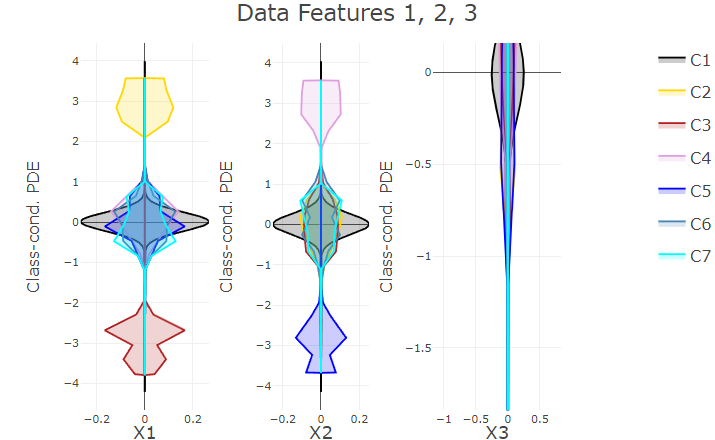

```{r setup, include=FALSE}
# setupKnitr()
# knitr::opts_chunk$set(echo = TRUE,
#                       fig.align = "center",
#                       warning = FALSE,
#                       webgl = TRUE,
#                       fig.width = 8, 
#                       fig.height = 8,
#                       fig.keep = "all",
#                       fig.ext = "jpeg"
#                       )
```
# PDE Naive Bayes (PDENB)

In naive Bayes assumptions about the feature distributions are necessary. Classically the assumption is, that the features are independent and gaussian distributed. The assumption of a Gaussian feature distribution might not reflect the real feature distributions, potentially impacting the model quality of the naive Bayes classifier. In contrast the PDENB uses a nonparametric approach in estimating the feature densities using the Pareto Density Estimation (PDE). The PDE is a hyper parameter free density estimator, since the Pareto Radius, the analog to the kernel band width in Kernel Density Estimators (KDE) is derived from the data itself using a information theoretic approach [Ultsch, 2005]. This gives the PDENB classifier more flexibility on modeling the feature distributions and reduce the reliance on pre defined assumption on the data [Stier et al., 2026]. Additionally the PDENB allows for a plausible posterior corrections in regions with high uncertainty [Stier et al., 2026].


## Fitting a PDENB model

First load the Hepta dataset, which is a 3 dimensional data set of 7 well separable clusters:

```{r,fig.width=5, fig.height=5}
library(PDEnaiveBayes)

data(Hepta)
Data = Hepta$Data
Cls = Hepta$Cls
```

Fitting the PDENB classifier

```{r,fig.width=5, fig.height=5}

model = Train_naiveBayes(Data, 
                          Cls, 
                          Gaussian = FALSE, 
                          Plausible = FALSE)
table(Cls, model$ClsTrain)

```
For the `Train_naiveBayes()` function, further optional arguments can be specified — for example, `Gaussian = TRUE`, when, as in classic Naive Bayes, the assumption is of Gaussian-distributed features.  

If the `Gaussian` argument is not specified or is set to `FALSE` (the default), then the nonparametric PDE approach is used.  

Furthermore, a plausible correction of the posteriors is performed by default in regions of high uncertainty, but this can be deactivated by setting `Plausible = FALSE`.  

The class-conditional likelihoods can be plotted by setting `PlotIt = TRUE`.  

It is also possible to train the PDENB model in parallel through a multicore implementation.  
For this, the user must specify, in addition to the input data, a cluster object from the **parallel** package:

```{r,fig.width=5, fig.height=5, eval = FALSE}

if (requireNamespace("parallel")) {

  library(parallel)
  
  train_index = sample(1:nrow(Data), 0.8 * nrow(Data))
  
  train_data = Data[train_index, ]
  test_data = Data[-train_index, ]
  train_cls = Cls[train_index]
  test_cls = Cls[-train_index]
  
  num_cores = detectCores() - 1
  cl = makeCluster(num_cores)
  if (requireNamespace("FCPS")) {
    data(Hepta)
    Data = Hepta$Data
    Cls  = Hepta$Cls
    model_mc = Train_naiveBayes_multicore(
      cl       = cl,
      Data     = train_data,
      Cls      = train_cls,
      Predict  = TRUE
    )
    table(train_cls, model_mc$ClsTrain)
  }
}
```


Optionally the `Train_naiveBayes_multicore()` also allows the usage of the **memshare**-package, for reducing memory usage in parallel computing, through setting the argument `UseMemshare = TRUE`

Predictions with the PDENB model:

```{r,fig.width=5, fig.height=5, eval=FALSE}
preds = Predict_naiveBayes(test_data, model_mc)
table(test_cls, preds$Cls)
```

## Visualization and interpretation

The **PDEnaiveBayes** package offers several visualization methods, which can be helpful in interpreting the fitted model.

The `PlotLikelihoodFuns()` function can be used to plot the estimated class-conditional likelihoods $p(\mathbf{x^{(i)}} \mid c_k)$ per feature:

Exemplary here it can be seen, that around 0 one class has the highest likelihood in all feature dimensions, which corresponds to the middle cluster in the Hepta data set.

```{r,fig.width=5, fig.height=5}
PlotLikelihoodFuns(
  LikelihoodFuns = model$Model$PDFs_funs,
  Data        = Hepta$Data
)
```


Another option of visualizing the estimated class-conditional likelihoods per feature is through Mirror Density Plots (MD-Plots), which can be helpful in identifying discriminating features.

```{r,fig.width=5, fig.height=5, eval = FALSE}
# CRAN does not allow interactive plotly plots, hence the plot is given as a static image
PlotNaiveBayes(Model = model$Model, FeatureNames = colnames(Hepta$Data))
```



Visualizing the posteriors or more general the decision boundaries of the classifier in more than 2 or 3 dimensions is challenging. The function `PlotBayesianDecision2D()` allows to visualize an estimation of the decision boundary of the PDENB classifier, by considering 2D slices of the data and using the posteriors of the data points in combination with a Voronoi diagram to plot estimations of the decision boundary of the classifier. 

```{r,fig.width=5, fig.height=5}
PlotBayesianDecision2D(
  X          = Hepta$Data[, 1],
  Y          = Hepta$Data[, 2],
  Posteriors = model$Posteriors,
  Class      = 2,
  xlab = "X1",
  ylab = "X2"
)
```
The plot shows the Voronoi tessellations for each data point in the first and second feature dimensions, where each tessellation is the region which is closest to the data point in the tessellation. The red colored regions are then the regions, where the posteriori of class 2 are maximal, which allows an interpretation of the decision boundaries of the classifier.

The function `PlotPosteriors()`, for a given class plots the above plot for each possible 2D slice combination of the data set.

```{r,fig.width=5, fig.height=5}
PlotPosteriors(
  Data       = Data,
  Posteriors = model$Posteriors,
  Class      = 2)
```

## Plausible Bayes correction

As example consider a univariate Gaussian mixture of two distributions, where the class labels are sampled according to the densities of the components. In this example the component with a mode on the right side, due to a higher variance, has a minimal higher density on the left most side of the distributions. This can result in the naive Bayes classifier, classifying all data points far enough on the left as coming from the second mode, even if the second mode has a high distance to the data points. In real world classification problems this can lead to non-intuitive classifications. An examples for this is given in [Stier et al., 2025] where a naive Bayes classifier classifies the humans with highest height as woman instead of men, because the the women height class has a higher variance. If in the `Train_naiveBayes()` `Plausbile=TRUE` is set, a correction to the likelihoods and posteriors is done to potentially avoid such non intuitive classifications in regions of high uncertainty. Further examples are given in [Ultsch/Lötsch, 2022].


```{r,fig.width=5, fig.height=5}

x1 = rnorm(1000,0,2)
x2 = rnorm(1000,5,5.5)
x = c(x1, x2)

f1 = dnorm(x, 0, 2)
f2 = dnorm(x, 5, 5.5)
p1 = f1 / (f1 + f2)
comp = rbinom(2000, 1, p1) + 1

model_1d = Train_naiveBayes(as.matrix(x), 
                          comp, 
                          Gaussian = FALSE, 
                          Plausible = TRUE,
                          PlotIt = TRUE)

```


# References

[Stier et al., 2026]	Stier, Q.,Hoffmann, J. & Thrun, M. C.: Classifying with the Fine Structure of Distributions: Leveraging Distributional Information for Robust and Plausible Naïve Bayes, Machine Learning and Knowledge Extraction (MAKE), Vol. 8(1), 13, doi 10.3390/make8010013, MDPI, 2026. 

[Ultsch, 2005] Ultsch, A.: Pareto Density Estimation: A Density Estimation for Knowledge Discovery, in Baier, D.; Wernecke, K.-D. (Eds.), Innovations in Classification, Data Science, and Information Systems (Proc. 27th Annual GfKl Conference), Springer, Berlin, pp. 91–100, https://doi.org/10.1007/3-540-26981-9_12, 2005.

[John/Langley, 1995] John, G. H. / Langley, P.: Estimating Continuous Distributions in Bayesian Classifiers, in Proceedings of the Eleventh Conference on Uncertainty in Artificial Intelligence (UAI–95), Morgan Kaufmann, San Mateo, pp. 338–345, 1995.

[Ultsch/Lötsch, 2022] Ultsch, A., & Lötsch, J.: Robust classification using posterior probability threshold computation followed by Voronoi cell based class assignment circumventing pitfalls of Bayesian analysis of biomedical data, International Journal of Molecular Sciences, Vol. 23(22), pp. 14081, 2022b.